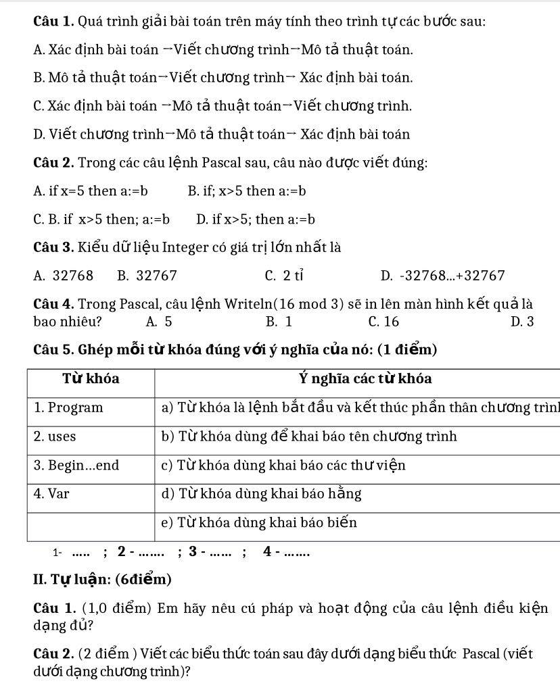
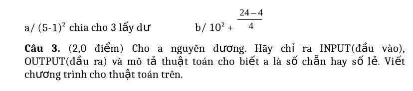

## Ảnh 1-1 - 1-2

### Trắc nghiệm
- Câu 1: C
- Câu 2: A
- Câu 3: B
- Câu 4: B
- Câu 5: 1 - B, 2 - C, 3 - A, 4 - E

### Tự luận
- Câu 1: 
  - Lệnh điều kiện dạng đủ là: if <điều kiện> then <câu lệnh 1> else <câu lệnh 2>
  - **B1:** Tính điều kiện
  - **B2:** Nếu đúng, thực hiện câu lệnh 1
  - **B3:** Nếu sai, thực hiện câu lệnh 2

- Câu 2:
  - a. (5 - 1)^2 chia 3 lấy dư -> ((5 - 1) * (5 - 1)) mod 3 -> (sqr(5 - 1)) mod 3
  - b. 10^2 + (24 - 4)/4 -> 10 * 10 + (24 - 4)/4

- Câu 3:
  - Input: số a nguyên dương
  - Output: Số lẻ/chẵn
  - Thuật toán:
    - B1: Lấy số a chia cho 2 lấy dư.
    - B2: Nếu dư = 1 thì in "a là số lẻ"
    - B3: Ngược lại, nếu dư = 0 thì in "a là số chẵn"
    
