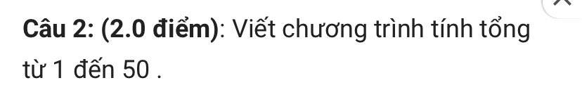

## Ảnh 3


- Câu 2:
```
program TinhTong;
var i, sum: integer;

begin
    sum := 0;
    for i := 1 to 50 do
        begin
          sum := sum + i;
        end;
    writeln(sum);
    readln();
end.
```