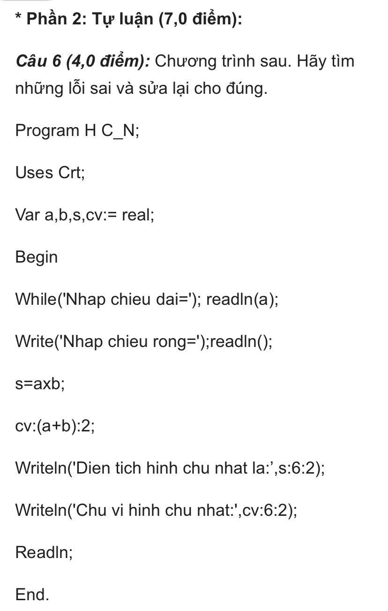

### Ảnh 4

- Câu 6:
  - Ở dòng 3, đổi `:=` thành `:` -> `Var a, b, s, cv: real`
  - Ở dòng 5, đổi `While` thành `WriteLn` -> `WriteLn('Nhap chieu dai ='); readln(a);`
  - Ở dòng 6, đổi `Write` thành `WriteLn`; đổi `readln()` thành `ReadLn(b)` -> `WriteLn('Nhap chieu rong ='); readln(b)`
  - Ở dòng 7, đổi `=` thành `:=`; đổi `x` thành `*` -> `s := a * b`
  - Ở dòng 8, đổi `:` thành `:=`; đổi `:` thành `*` -> `cv := (a + b) * 2`