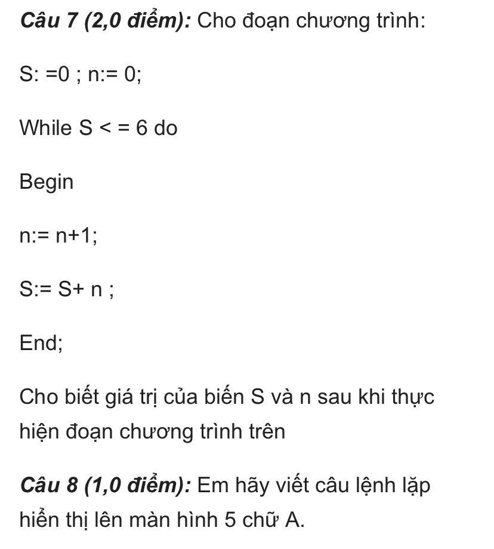
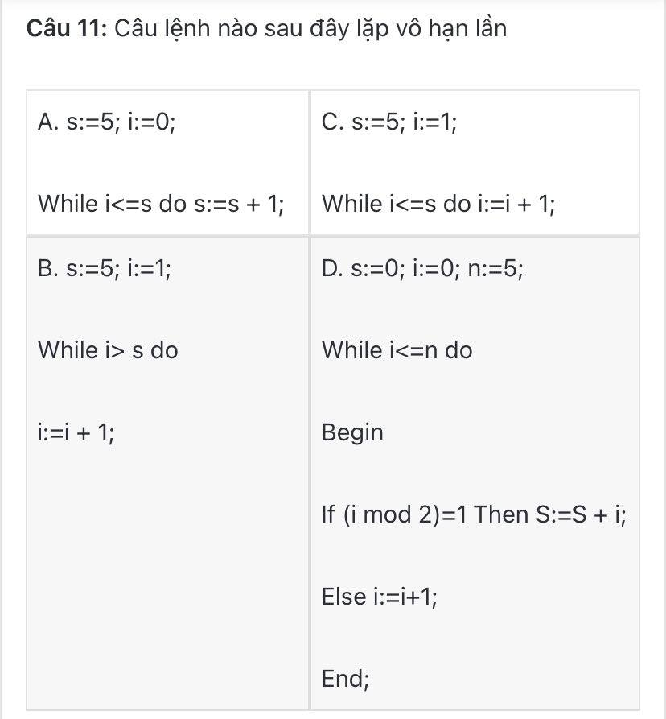
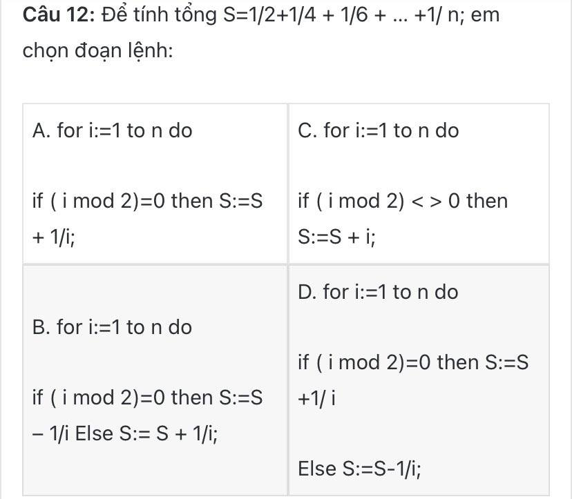

### Ảnh 5




- Câu 7:
  - Giá trị của biến `S` là: `21`
  - Giá trị của biến `n` là: `6`

- Câu 8:
  ```
    program hienthi;
    var i: integer;

    begin
        for i := 1 to 5 do WriteLn('A');
    end.
  ```

- Câu 11: A
- Câu 12: A