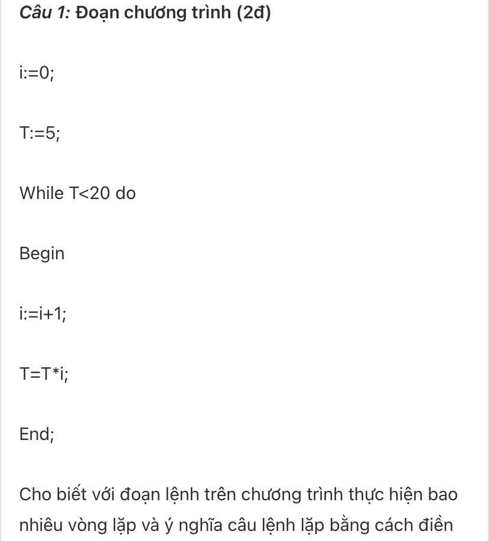
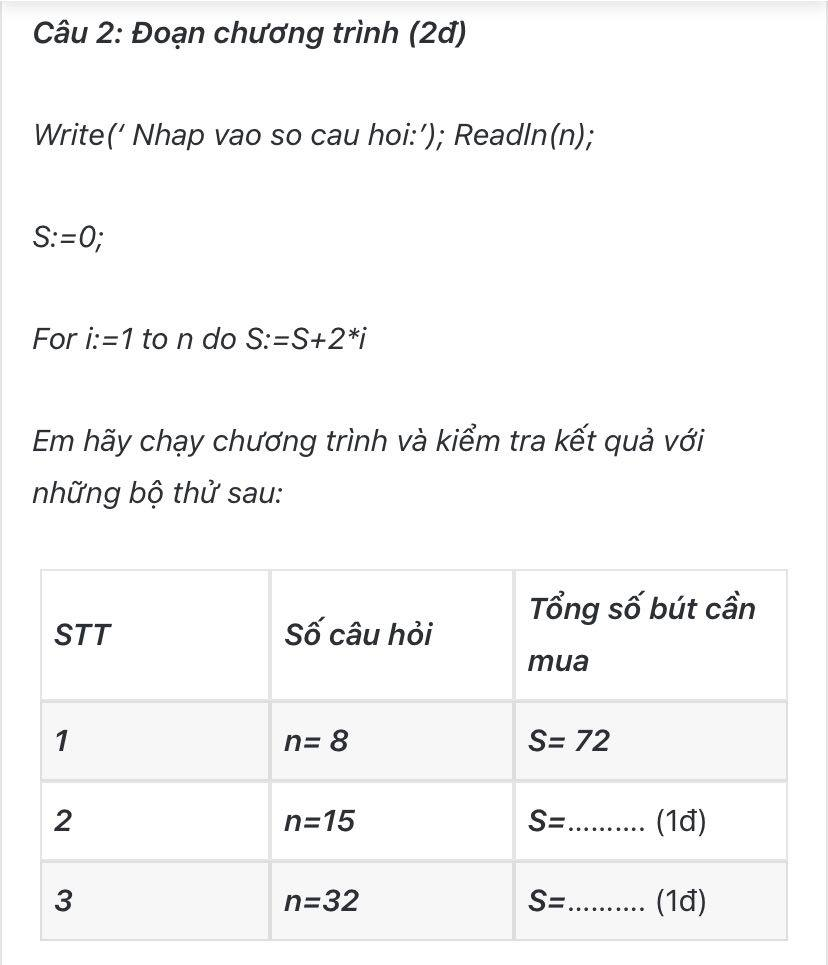

### Ảnh 6



- Câu 1: `not enough information`
- Câu 2: 
```
program sobut;
var n, s, i: integer;

begin
  WriteLn('Nhap vao so cau hoi');
  ReadLn(n);
  
  s := 0;

  for i := 1 to n do s := s + 2 * i;
  WriteLn('s = ', s);
end.
```
| STT | Số câu hỏi | Tổng số bút cần mua |
|-----|------------|---------------------|
| 1   | n = 8      | S = 72              |
| 2   | n = 15     | S = 240             |
| 3   | n = 32     | S = 1056            |