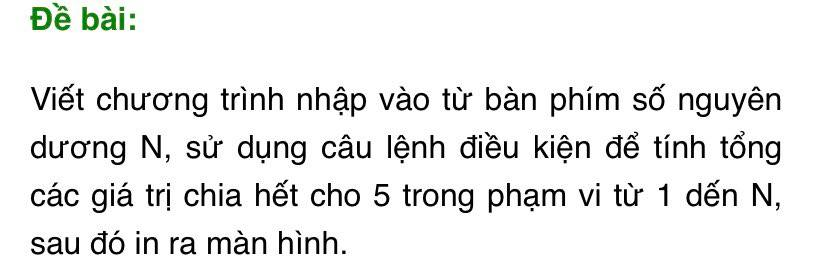

### Ảnh 7


```
program TinhTong;
var i, count, n: integer;

begin
    writeln('Nhap n: ');
    readln(n);

    for i := 1 to n do
        begin
            if (i mod 5 = 0) then count := count + 1;
        end;

    writeln('So so chia het cho 5 tu 1 -> n la ', count);
    readln;
end.
```