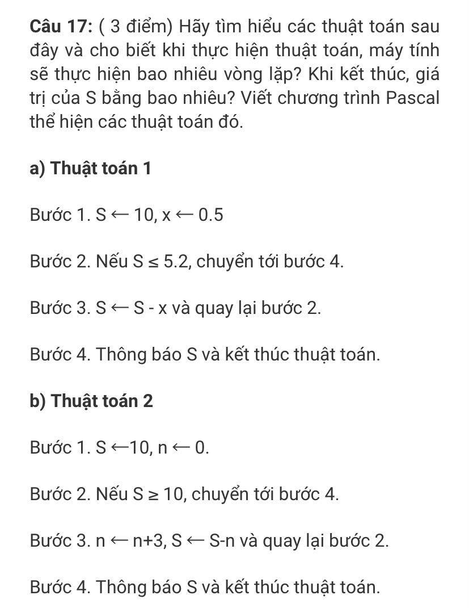
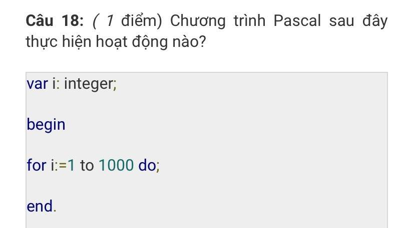

### Ảnh 8



- Câu 17a:
  - Máy tính sẽ thực hiện 12 vòng lặp.
  - Cuối cùng, S có giá trị = 5
```
program tt1;
var s, i, x: integer;

begin

    s := 10;
    x := 0.5;

    while (s > 5.2) do s := s - x;
    
    writeln('s = ', s);

  end.
```

- Câu 17b:
  - Máy tính sẽ thực hiện 0 vòng lặp 
  - Cuối cùng, S có giá trị = 10
```
program tt2;
var s, n: integer;

begin
  s := 10;
  n := 0;

  while (s < 10) do
    begin
      n := n + 3;
      s := s - n;
    end;
    WriteLn('s = ', s);
end.
```

Câu 18:
- Chương trình pascal sau sẽ chạy vòng lặp 1000 lần, từ 1 -> 1000. Trong vòng lặp không thực hiện gì.